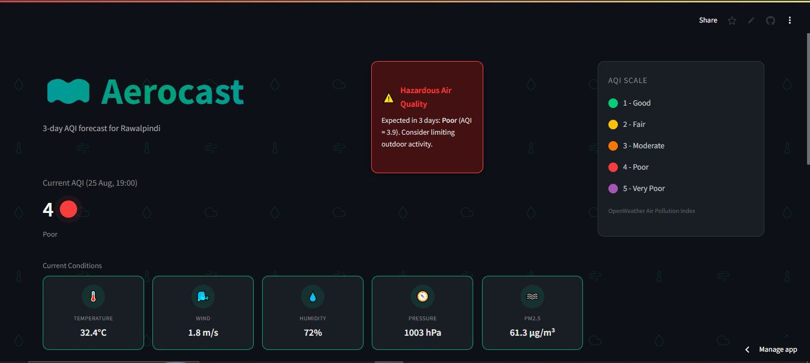
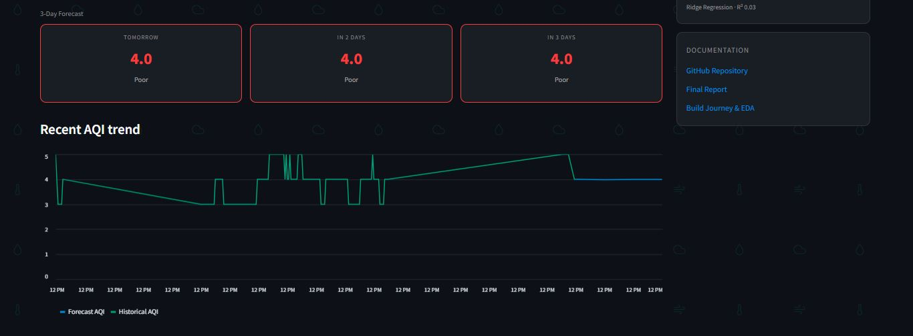

# 🌫️ Aerocast — Rawalpindi AQI Predictor

Aerocast is an end-to-end, serverless Air Quality Index (AQI) prediction system for Rawalpindi, Pakistan. It fetches live pollution data every hour, stores it in a feature store, trains machine learning models to forecast AQI up to 3 days ahead, and displays everything on a live, interactive dashboard.

Built as part of the 10Pearls data science internship, following the Feature/Training/Inference (FTI) pipeline architecture.

**🔗 Live Dashboard:** [aqi-predictor-tw2dzfvcujetjpaevpmn6v.streamlit.app](https://aqi-predictor-tw2dzfvcujetjpaevpmn6v.streamlit.app)
**📄 Full Project Report:** [REPORT.md](./REPORT.md)

---

## Preview





## Overview

Aerocast predicts AQI for Rawalpindi 1, 2, and 3 days ahead using historical pollution data, and presents current conditions, forecasts, and trends through a Streamlit dashboard — with hazardous air quality alerts built in.

## Architecture

This project follows a 4-stage FTI (Feature / Training / Inference) pipeline:

```
OpenWeather API  ──raw data──>  Feature Pipeline  ──features──>  Hopsworks Feature Store
                                  (hourly, via                          │
                                   GitHub Actions)                      │
                                                                         ▼
                                                              Training Pipeline (daily)
                                                                         │
                                                                         ▼
                                                              Hopsworks Model Registry
                                                                         │
                                                                         ▼
                                                          Streamlit Dashboard (Aerocast)
```

## Features

- **Live current AQI** for Rawalpindi, with color-coded severity indicator
- **3-day-ahead AQI forecast**, using 3 independently trained Ridge Regression models (1-day, 2-day, 3-day horizons)
- **Hazardous air quality alerts**, automatically triggered when any forecasted day crosses the "Poor" threshold
- **Current weather conditions** (temperature, wind, humidity, pressure) and PM2.5 concentration
- **7-day historical AQI trend**, connected directly to the 3-day forecast on the same chart
- **Fully automated pipeline**: hourly feature updates and daily model retraining via GitHub Actions , no manual intervention required

## Tech Stack

| Component | Technology |
|---|---|
| Data source | OpenWeather Air Pollution API, OpenWeather Weather API |
| Feature Store & Model Registry | Hopsworks (free tier) |
| ML Models | Scikit-learn (Ridge Regression) |
| Automation / CI-CD | GitHub Actions |
| Dashboard | Streamlit (Streamlit Community Cloud) |
| Language | Python |

## Repository Structure

```
AQI-Predictor/
├── app.py                          # Streamlit dashboard
├── feature_pipeline.py             # One-time historical backfill script
├── hourly_feature_update.py        # Hourly feature ingestion (runs via GitHub Actions)
├── training_pipeline.py            # Daily model training script (runs via GitHub Actions)
├── requirements.txt
├── .github/
│   └── workflows/
│       ├── hourly_feature.yml      # Triggers hourly_feature_update.py every hour
│       └── daily_training.yml      # Triggers training_pipeline.py once a day
├── .streamlit/
│   └── secrets.toml                # Local API keys (gitignored, not committed)
├── README.md
└── REPORT.md                       # Full project report
```

**⚠️ Known limitation:** Since Aug 26, 2026, a platform-side bug on Hopsworks' free tier has caused the offline feature store's materialization job to fail (confirmed via error logs, execution history, and a second independent Hopsworks project experiencing the same issue). As a result, the dashboard's "Current AQI" timestamp and 7-day trend chart are showing data current as of Aug 25, rather than live. The hourly data ingestion pipeline itself is confirmed working correctly (verified via GitHub Actions logs) — the failure is isolated to Hopsworks' backend storage layer, not this project's code. Full investigation, evidence, and timeline are documented in [REPORT.md](./REPORT.md).

## Running Locally

1. Clone the repository:
   ```bash
   git clone https://github.com/aemannadeem62004-sudo/AQI-Predictor.git
   cd AQI-Predictor
   ```

2. Create a virtual environment and install dependencies:
   ```bash
   python -m venv venv
   venv\Scripts\activate       # Windows
   pip install -r requirements.txt
   ```

3. Add your API keys in `.streamlit/secrets.toml`:
   ```toml
   HOPSWORKS_API_KEY = "your_key_here"
   OPENWEATHER_API_KEY = "your_key_here"
   ```

4. Run the dashboard:
   ```bash
   streamlit run app.py
   ```

## Author

**Aeman Nadeem**

